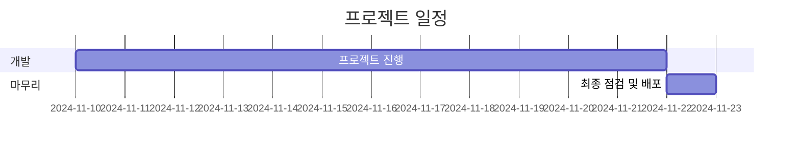

# 실행방법

```bash
bash deploy.sh
```

# 프로젝트명: 희노애락 밈 통역사

## 1. 프로젝트 개요

### 1.1 목적
사용자의 상황을 입력받아 해당 상황에 적합한 밈을 변환하여 반환하는 서비스를 제공합니다.

### 1.2 배경
상황을 밈으로 표현함으로써 유쾌하고 효과적인 의사소통을 가능하게 합니다.

## 2. 팀 구성
| 역할 | 담당자 |
|------|--------|
| 프론트엔드 개발 | @rookedsysc |
| 백엔드 개발 | @SeungjaeDanLee |
| UI/UX 디자인 | @rookedsysc |
| 인프라 관리 | @jjeongmin98 |
  
## 3. 주요 기능

- 텍스트 입력을 통한 상황 설명
- 상황에 맞는 밈 이미지 추천
- 밈 이미지 커스터마이징 옵션
- 생성된 밈 공유 기능

## 4. 기술 스택

| 분야 | 사용 기술 |
|------|-----------|
| 프론트엔드 | React |
| 백엔드 | Spring Boot |
| 인프라 | Docker Compose |


## 5. 프로젝트 일정



## 6. 도메인
서비스 도메인: [meme.rookedsysc.com](http://meme.rookedsysc.com)

## 7. 진행 상황
| 작성자 | 역할 | 작업 내용 | 상태 | 완료일 | 비고 |
|-------|------|----------|------|-------|------|
| <td colspan="6" align="center">**1주차 ~ 2주차**</td> |
| @rookedsysc | frontend, backend개발자 | 홈페이지 제작 | ✅ | 2024-11-19 | 완료 |
| @SeungjaeDanLee | backend 개발자 | api 서버 생성 | ✅ | 2024-11-19 | 완료 |
| @jjeongmin98 | infra 엔지니어 | front(node) container, front(react) contaer 생성 | ✅ | 2024-11-19 | 완료 |

| 작성자 | 역할 | 작업 내용 | 상태 | 완료일 | 비고 |
|-------|------|----------|------|-------|------|
| <td colspan="6" align="center">**3주차**</td> |
| @rookedsysc | frontend, backend개발자 | 구글 에널리언스 적용 | 🚧 | - | 진행중 |
| @rookedsysc | frontend, backend개발자 | 광고 적용 | 🚧 | - | 진행중 |
| @SeungjaeDanLee | backend 개발자 | 밈 데이터 db input | 🚧 | - | 진행중 |
| @SeungjaeDanLee | backend 개발자 | 따봉 옵션 추가 | 🚧 | - | 진행중 |
| @SeungjaeDanLee | backend 개발자 | historty 등록 | 🚧 | - | 진행중 |
| @SeungjaeDanLee | backend 개발자 | 하루 단위 리스트 추가 | 🚧 | - | 진행중 |
| @jjeongmin98 | infra 엔지니어 | nginx -> node 포워딩 | ✅ | 2024-11-23 | 완료 |
| @jjeongmin98 | infra 엔지니어 | certbot을 통한 ssl 인증서 적용 | 🚧 | - | 진행중 |
| @jjeongmin98 | infra 엔지니어 | ssl 인증서 자동 갱신 | ✅ | 2024-11-23 | 완료 |
| @jjeongmin98 | infra 엔지니어 | nignx 취약점 설정 | ✅ | 2024-11-23 | 완료 |
| @jjeongmin98 | infra 엔지니어 | logrotate 설정 | ✅ | 2024-11-23 | 완료 |
| @jjeongmin98 | infra 엔지니어 | jenkins 컨테이너 추가 | ✅ | 2024-11-23 | 완료 |
| @jjeongmin98 | infra 엔지니어 | jenkins github 연동 | ❌ | - | 미시작 |

